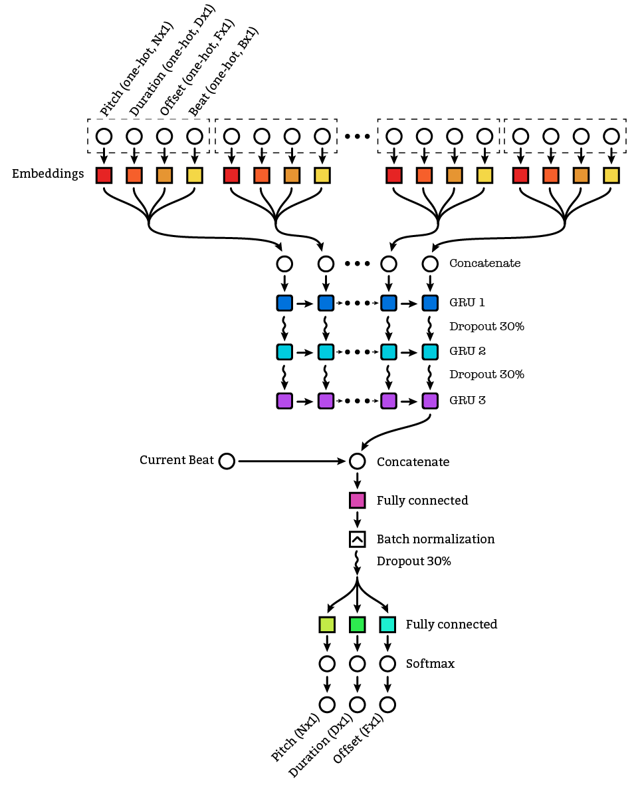

Deep Piano
==========

Generating music using deep learning
------------------------------------

Examples
--------

A few generated songs from the Bach dataset:
- [Audio](examples/20180522-1935_02bb63_epoch_83.mid.ogg) ([seed sequence source](examples/20180522-1935_02bb63_epoch_83.txt), [midi](examples/20180522-1935_02bb63_epoch_83.mid))
- [Audio](examples/20180522-1935_02bb63_epoch_65.mid.ogg) ([seed sequence source](examples/20180522-1935_02bb63_epoch_65.txt), [midi](examples/20180522-1935_02bb63_epoch_65.mid))

A few generated songs from the Final Fantasy dataset
- [Audio](examples/20180522-1934_9944ab_epoch_113.mid.ogg) ([seed sequence source](examples/20180522-1934_9944ab_epoch_113.txt), [midi](examples/20180522-1934_9944ab_epoch_113.mid))
- [Audio](examples/20180522-1934_9944ab_epoch_121.mid.ogg) ([seed sequence source](examples/20180522-1934_9944ab_epoch_121.txt), [midi](examples/20180522-1934_9944ab_epoch_121.mid))

A few songs generated based a completely random input sequence, but on a network trained on Bach (usually doesn't sound very good):
- [Audio](examples/20180522-1403_572db3_epoch_4.mid.ogg) ([midi](examples/20180522-1403_572db3_epoch_4.mid))
- [Audio](examples/20180522-1403_572db3_epoch_5.mid.ogg) ([midi](examples/20180522-1403_572db3_epoch_5.mid))

Network Architecture
--------------------

